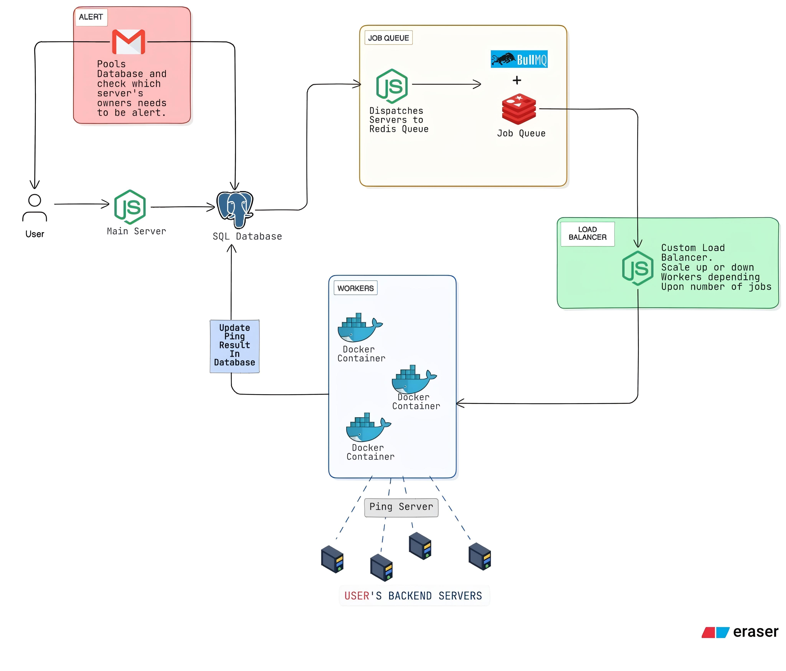

<div style="font-family: Arial, sans-serif;">

<table align="center">
  <tr>
    <td></td>
    <td><h1 style="margin: 0; padding-left: 10px;">Heimdall</h1></td>
  </tr>
</table>
<!-- #<br> -->
<div align="center"><h2><code>Server Uptime & Cold Start Monitoring Platform</code></h2></div>
<br>

<div align="center">

[](https://nodejs.org)
[](https://expressjs.com/)
[](https://www.postgresql.org/)
[](https://www.docker.com/)
[](https://aws.amazon.com/ec2/)
[](https://reactjs.org/)
[](https://recoiljs.org/)
[](https://docs.bullmq.io/)
[](https://www.prisma.io/)
[](https://nodemailer.com/)
[](https://pm2.keymetrics.io/)
[](https://github.com/)
[](https://vercel.com/)
[](https://render.com/)


</div>

---

## 🌟 Overview

**Heimdall** is a comprehensive ping and uptime monitoring platform designed to eliminate cold starts on free hosting platforms like **Render**, **Railway**, and **Fly.io**. By intelligently pinging your backend servers at customizable intervals, Heimdall ensures optimal performance while providing detailed analytics and instant alerts.

> **🎯 Mission**: Keep your servers warm, your users happy, and your deployments reliable.

---

## ✨ Key Features

<table>
<tr>
<td width="50%">

### 🚀 **Performance Optimization**
- **Cold Start Prevention** — Reduce delays by 30-50 seconds
- **Intelligent Pinging** — Customizable intervals per server
- **Smart Resource Management** — Heap & RSS memory tracking

</td>
<td width="50%">

### 📊 **Advanced Monitoring**
- **Real-time Metrics** — Response time, uptime %, status codes
- **Interactive Dashboard** — Visual latency trends and history
- **Performance Analytics** — Comprehensive server health insights

</td>
</tr>
<tr>
<td width="50%">

### 🔔 **Intelligent Alerting**
- **Email Notifications** — Instant failure alerts
- **Smart Spam Prevention** — Configurable thresholds
- **24/7 Monitoring** — Continuous health checks

</td>
<td width="50%">

### 🏗️ **Scalable Architecture**
- **6-Microservice Design** — Clean separation of concerns
- **Queue-Based Processing** — BullMQ + Redis integration
- **Horizontal Scaling** — Load balancer ready

</td>
</tr>
</table>

---

## 🏛️ Architecture Overview

<div align="center">

</div>

### 🧱 Microservices Breakdown

| 🎯 Service | 📝 Description | 🔧 Technology |
|------------|-----------------|---------------|
| **🌐 API Service** | User management, authentication, server CRUD operations | Express.js, Prisma |
| **⚡ Queue Service** | Job scheduling and Redis queue management | BullMQ, Redis |
| **🔍 Ping Worker** | Server pinging, performance metrics collection | Node.js, Docker |
| **📧 Alert Service** | Email notifications and alert management | Nodemailer, SMTP |
| **⚖️ Load Balancer** | Worker distribution and scaling | Node.js, Docker |
| **💻 Client Dashboard** | Interactive monitoring interface | React, TailwindCSS |

---

## 🛠️ Technology Stack

### 🖥️ **Backend Infrastructure**
| Technology | Badge | Purpose |
|------------|-------|---------|
| **Node.js** |  | Runtime Environment |
| **Express.js** |  | Web Framework |
| **Prisma** |  | ORM & Database Client |

### 🗄️ **Database & Storage**
| Technology | Badge | Purpose |
|------------|-------|---------|
| **PostgreSQL** |  | Primary Database |
| **Redis** |  | Caching & Queue Storage |

### 📬 **Queue System**
| Technology | Badge | Purpose |
|------------|-------|---------|
| **BullMQ** |  | Job Queue Management |
| **Redis Queue** |  | Queue Backend |

### 🎨 **Frontend**
| Technology | Badge | Purpose |
|------------|-------|---------|
| **React** |  | UI Library |
| **TailwindCSS** |  | Styling Framework |

### 📧 **Communication**
| Technology | Badge | Purpose |
|------------|-------|---------|
| **Nodemailer** |  | Email Service |
| **SMTP** |  | Email Protocol |

### 🚀 **DevOps & Deployment**
| Technology | Badge | Purpose |
|------------|-------|---------|
| **Docker** |  | Containerization |
| **Render** |  | Hosting Main Server, Dispatch Service |
| **AWS EC2** |  | Hosting Alert Service, Worker and Scale Worker Service |
| **Vercel** |  | Hosting Frontend |


---

## 🚀 Quick Start Guide

### 📋 Prerequisites

Ensure you have the following installed:
- **Node.js** (v18 or higher)
- **pnpm/npm** (Package manager)
- **Docker** (For Redis & PostgreSQL)
- **Git**

### ⚡ Installation Steps

```bash
# 1️⃣ Clone the repository
git clone https://github.com/yourusername/heimdall.git
cd heimdall

# 2️⃣ Install dependencies for each microservice
cd service && npm install && cd ../
cd alert-service && npm install && cd ../
cd dispatch-service && npm install && cd ../
cd client && npm install && cd ../
cd scale-worker-service && npm install && cd ../

# 3️⃣ Configure environment variables for each service
cp service/.env.example service/.env
cp alert-service/.env.example alert-service/.env
cp dispatch-service/.env.example dispatch-service/.env
cp client/.env.example client/.env
cp scale-worker-service/.env.example scale-worker-service/.env
# Edit each .env file with your own configuration

# 4️⃣ Build and dockerize worker-service (used by scale-worker-service)
cd worker-service
cp .env.example .env
docker build -t heimdall-worker .
cd ../

# 5️⃣ Initialize the PostgreSQL database (only from the API service)
cd service
npx prisma migrate dev
npx prisma generate
cd ../

# 6️⃣ Start each service individually (see below)

```

```bash
# 🌐 Start the API Service (REST API & Auth)
cd service
npm run dev

# 📧 Start the Alert Service (email notifications)
cd alert-service
npm run dev

# ⚡ Start the Dispatch Service (job queue logic)
cd dispatch-service
npm run dev

# 💻 Start the Frontend Client (React dashboard)
cd client
npm run dev

# ⚖️ Start the Scale Worker Service (manages auto-scaling of dockerized workers)
cd scale-worker-service
npm run dev

# 🔍 Worker Service (Ping engine)
# ✅ Dockerized, DO NOT start manually
# ✅ Built in Step 4 as `heimdall-worker` image

```

---

## 📁 Project Structure

```
heimdall/
├── 🌐 service/                             # REST API & Authentication
│   ├── src/
│   │   ├── controllers/                    # Route handlers
│   │   ├── middleware/                     # Auth & validation
│   │   └── routes/                         # API endpoints
│   │   └── index.js                        # Entry Point
│   └── package.json
│
├── 🔍 worker-service/                      # Ping Processing Engine
│   ├── src/
│   │   └── index.ts                        # Entry Point
│   └── package.json
│
├── 📧 alert-service/                       # Notification System
│   ├── src/
│   │   ├── utils/                          # Helpers and Templates
│   │   │   └── mailer.ts                   # SMTP configuration & Template
│   │   └── index.ts                        # Entry Point
│   └── package.json
│
├── ⚡ dispatch-service/                    # Job Queue Management
│   ├── src/
│   │   └── index.ts                        # Entry Point
│   └── package.json
│
├── 💻 client/                              # React Dashboard
│   ├── src/
│   │   ├── assets/                         # Static Assets
│   │   ├── components/                     # UI components
│   │   ├── hooks/                          # Hooks for data fetching and other operation
│   │   ├── layouts/                        # Gather components
│   │   ├── pages/                          # Gather components and layouts
│   │   ├── skeleton/                       # Loading Screens
│   │   ├── stores/                         # Store Recoil Atoms
│   │   ├── styles/                         # Setting up tailwind css
│   │   │   └── globals.css                 # 
│   │   ├── utils/                          # Helper functions
│   │   │   └── cn.ts                       # Used for third part component libraries(like shadcn, magicUI) to run properly
│   │   └── App.tsx                         # Entry Point 
│   └── package.json
│
└── ⚖️ scale-worker-service/                # Worker Scaling
    └── src/
    │   └── index.ts                        # Entry Point
    └── package.json

```

## 🤝 Contributing
1. **Fork** the repository
2. **Create** a feature branch (`git checkout -b feature/amazing-feature`)
3. **Commit** your changes (`git commit -m 'Add amazing feature'`)
4. **Push** to the branch (`git push origin feature/amazing-feature`)
5. **Open** a Pull Request

---

<h2>📄 License</h2>

<p>
  This project is licensed under the <a href="./LICENCE"><strong>MIT License</strong></a>.
</p>

---

<div align="center">
<code> Made this BITCH with ❤️ </code>
</div>